# Reflection

Kusuma Ratih Hanindyani - 2306256406

## JMeter before optimization

### `all-student`
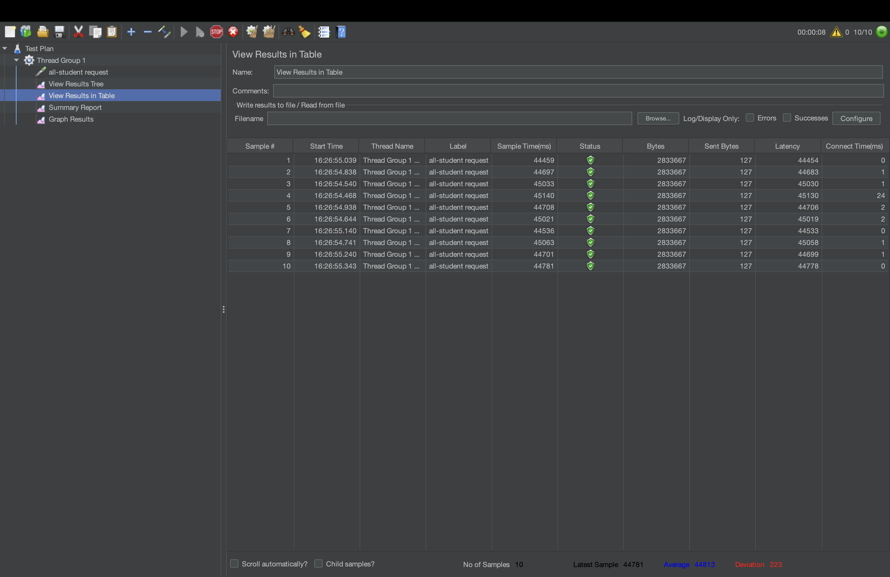
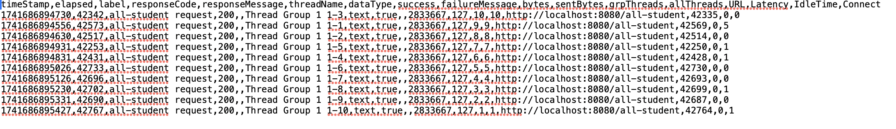

### `all-student-name`
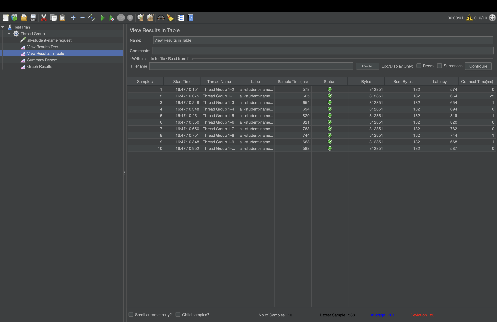
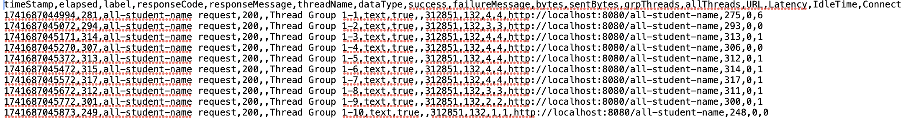

### `highest-gpa`
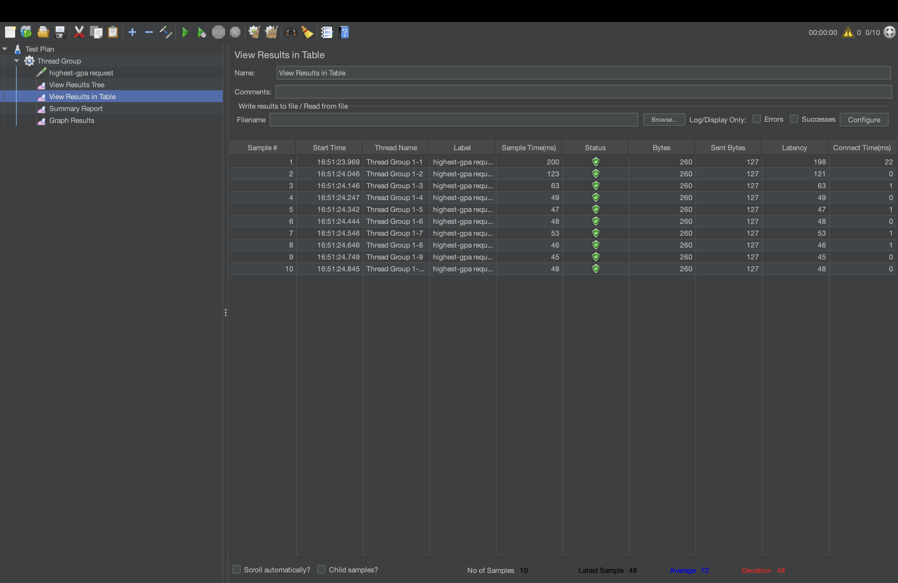
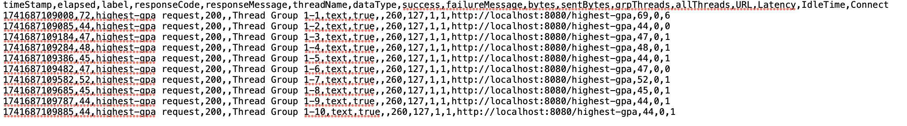

## Jmeter after optimization

### `all-student`
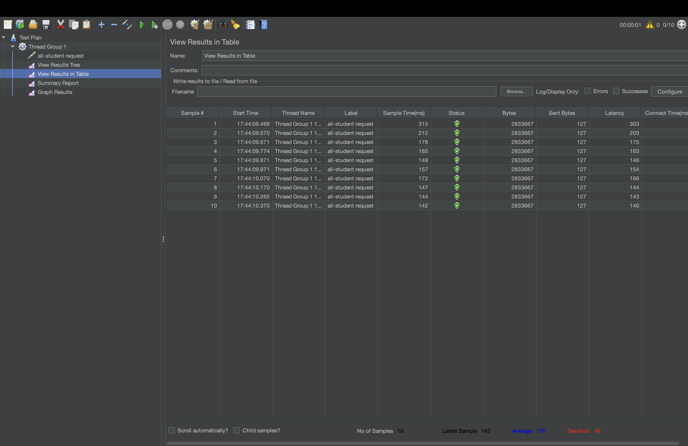
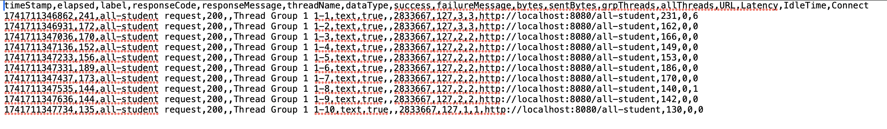

### `all-student-name`

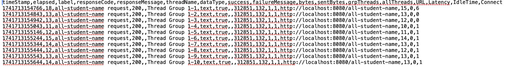

### `highest-gpa`
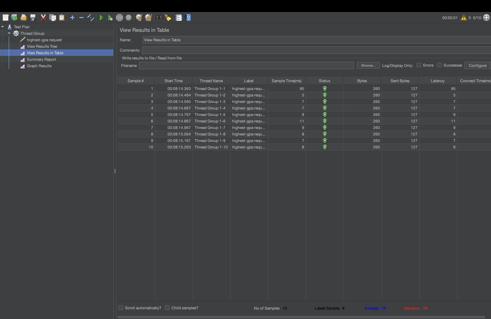
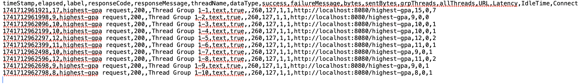

After optimization, the JMeter test results showed a significant improvement in execution time and resource efficiency. The optimized queries reduce the unnecessary data processing which lead to faster response times. This confirms that the optimizations have effectively enhanced application performance.

1. What is the difference between the approach of performance testing with JMeter and profiling with IntelliJ Profiler in the context of optimizing application performance?
   JMeter evaluates system performance under different loads, measuring response times and scalability. IntelliJ Profiler analyzes CPU, memory, and execution flow at the code level to identify performance constraints that slow down the application.

2. How does the profiling process help you in identifying and understanding the weak points in your application?
   Profiling highlights inefficient methods, high CPU usage, and memory-intensive operations. This allows developers to focus on optimizing critical areas that slow down the application.

3. Do you think IntelliJ Profiler is effective in assisting you to analyze and identify bottlenecks in your application code?
   Yes, IntelliJ Profiler helps in showing what  are inefficient by visualizing method execution time and resource consumption. This helps in resolving performance issues.

4. What are the main challenges you face when conducting performance testing and profiling, and how do you overcome these challenges?
   Creating realistic test scenarios and interpreting profiling data can be complex. This is addressed by refining test cases, analyzing profiling reports, and validating results across multiple runs.

5. What are the main benefits you gain from using IntelliJ Profiler for profiling your application code?
   It provides deep insights into CPU, memory usage, and method execution times. This helps optimize resource-intensive code and improves overall performance.

6. How do you handle situations where the results from profiling with IntelliJ Profiler are not entirely consistent with findings from performance testing using JMeter?
   Differences may arise due to external factors like database latency or network conditions. Cross-verifying logs, rerunning tests, and adjusting profiling scope help resolve discrepancies.

7. What strategies do you implement in optimizing application code after analyzing results from performance testing and profiling? How do you ensure the changes you make do not affect the application's functionality?
   Optimize database queries, reduce redundant loops, and implement caching where necessary. We ensure its correctness by repeating the tests after making performance improvements.

